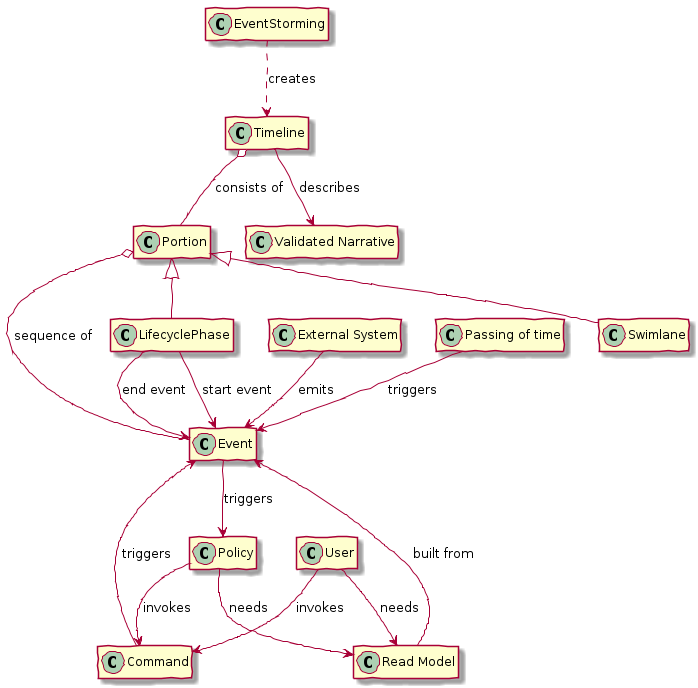

= A domain model of Event Storming

The purpose of this domain model is to name Event Storming concepts and the relationships between the concepts.
It's motivated by some Twitter threads:

* https://twitter.com/crichardson/status/1282760934923005952
* https://twitter.com/crichardson/status/1283114985275572224

== Big picture

== Description

The purpose of each element is as follows:

* Event Storming - a process that creates a Timeline
* Timeline - describes a validated narrative and consists of a sequence of events.
* Portion - part of a timeline
