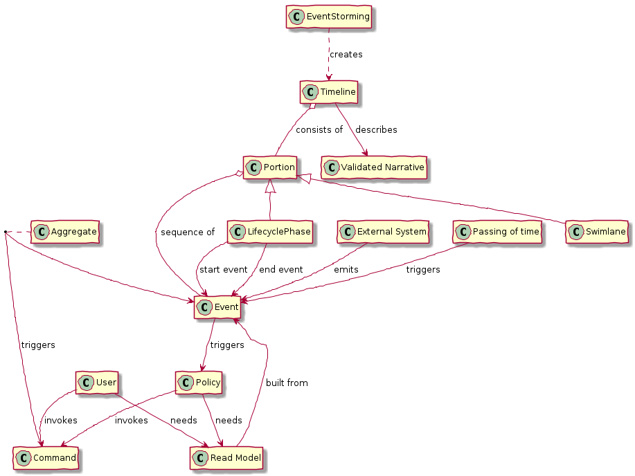

= A domain model of Event Storming

The purpose of this domain model is to identify and name event storming concepts and the relationships between the concepts.

The purpose of each element is as follows:

* Event Storming - a process that creates a Timeline
* Timeline - describes a validated narrative and consists of a sequence of events
* TODO
